# 网络诊断工具系统架构文档

## 1. 系统架构概览

### 1.1 整体架构图

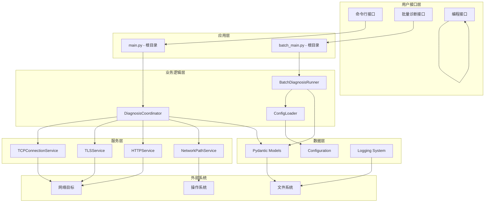

### 1.2 核心组件说明

| 组件 | 职责 | 主要功能 |
|------|------|----------|
| **应用入口层** | 用户交互接口 | 命令行解析、参数验证、结果展示 |
| **业务协调层** | 诊断流程管理 | 任务编排、并发控制、错误处理 |
| **服务执行层** | 具体诊断实现 | TCP/TLS/HTTP/路径追踪功能 |
| **数据模型层** | 数据结构定义 | 类型验证、序列化、配置管理 |
| **基础设施层** | 系统支持服务 | 日志记录、配置加载、文件操作 |

### 1.3 数据流向

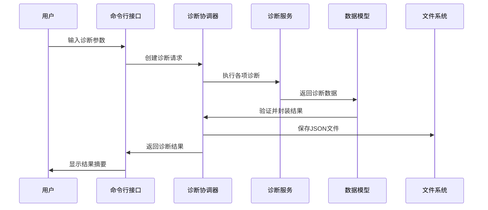

## 2. 组件详细说明

### 2.1 应用入口层

#### main.py - 单目标诊断入口（项目根目录）

```python
# 主要功能
- 命令行参数解析
- 单个目标诊断执行
- 结果格式化输出
- 错误处理和日志记录

# 核心接口
async def main() -> int

# 文件位置：/probing/main.py
# 运行方式：uv run python main.py <domain>
```

#### batch_main.py - 批量诊断入口（项目根目录）

```python
# 主要功能
- 配置文件验证
- 批量诊断执行
- 汇总报告生成
- 进度跟踪和状态管理

# 核心接口
async def main() -> int

# 文件位置：/probing/batch_main.py
# 运行方式：uv run python batch_main.py -c network-diagnosis/input/config.yaml
```

### 2.2 业务协调层

#### DiagnosisCoordinator - 诊断协调器
```python
class DiagnosisCoordinator:
    """统一管理所有诊断功能的协调器"""
    
    # 核心方法
    async def diagnose(self, request: DiagnosisRequest) -> NetworkDiagnosisResult
    async def _resolve_domain(self, domain: str) -> Optional[str]
    def save_result_to_file(self, result: NetworkDiagnosisResult) -> str
    
    # 服务依赖
    - TCPConnectionService: TCP连接测试
    - TLSService: TLS/SSL信息收集
    - HTTPService: HTTP响应分析
    - NetworkPathService: 网络路径追踪
```

#### BatchDiagnosisRunner - 批量诊断运行器
```python
class BatchDiagnosisRunner:
    """批量诊断任务的管理和执行"""
    
    # 核心方法
    async def run_batch_diagnosis(self) -> BatchDiagnosisResult
    async def _diagnose_with_semaphore(...) -> NetworkDiagnosisResult
    async def _save_batch_report(...)
    
    # 并发控制
    - asyncio.Semaphore: 控制最大并发数
    - asyncio.gather: 并行执行诊断任务
    - asyncio.wait_for: 超时控制
```

### 2.3 服务执行层

#### TCPConnectionService - TCP连接服务
```python
class TCPConnectionService:
    """TCP连接测试实现"""
    
    async def test_connection(self, host: str, port: int) -> TCPConnectionInfo:
        # 功能实现
        - socket.socket(): 创建TCP套接字
        - socket.connect_ex(): 非阻塞连接测试
        - 连接时间测量（毫秒级精度）
        - 错误状态捕获和处理
```

#### TLSService - TLS/SSL服务
```python
class TLSService:
    """TLS/SSL信息收集实现"""
    
    async def get_tls_info(self, host: str, port: int) -> Optional[TLSInfo]:
        # 功能实现
        - ssl.create_default_context(): SSL上下文创建
        - TLS握手时间测量
        - 证书信息解析（cryptography库）
        - 加密套件和协议版本获取
    
    def _parse_certificate(self, cert_data: bytes) -> Optional[SSLCertificateInfo]:
        # 证书解析功能
        - x509证书解析
        - 有效期计算
        - 指纹生成
        - 公钥信息提取
```

#### HTTPService - HTTP响应服务
```python
class HTTPService:
    """HTTP响应信息收集实现"""
    
    async def get_http_info(self, url: str) -> Optional[HTTPResponseInfo]:
        # 功能实现
        - httpx.AsyncClient: 异步HTTP客户端
        - 响应时间测量
        - 重定向跟踪
        - 响应头和状态码收集
        - 内容长度和类型分析
```

#### NetworkPathService - 网络路径服务
```python
class NetworkPathService:
    """网络路径追踪实现"""

    async def trace_path(self, host: str) -> Optional[NetworkPathInfo]:
        # 功能实现
        - mtr命令执行（优先，使用sudoers无密码配置）
        - traceroute命令备选
        - JSON输出解析（mtr --json格式）
        - 跳点信息提取（包含ASN信息）
        - 超时控制（30秒）

    async def _trace_with_mtr(self, host: str) -> Optional[NetworkPathInfo]:
        # mtr命令参数：sudo mtr -rwc 5 -f 3 -n -i 1 -4 -z --json
        # -rwc 5: 报告模式，等待完成，发送5个包
        # -f 3: 从第3跳开始
        # -n: 不解析主机名
        # -i 1: 包间隔1秒
        # -4: 强制IPv4
        # -z: 显示ASN信息
        # --json: JSON格式输出

    async def _trace_with_traceroute(self, host: str) -> Optional[NetworkPathInfo]

    def _parse_mtr_output(self, mtr_data: Dict[str, Any], host: str) -> NetworkPathInfo:
        # 解析mtr JSON输出，提取：
        # - 跳点IP地址和主机名
        # - 平均响应时间
        # - 丢包率
        # - ASN信息
        # - 数据包统计

## 3. 调用关系图

### 3.1 模块依赖关系

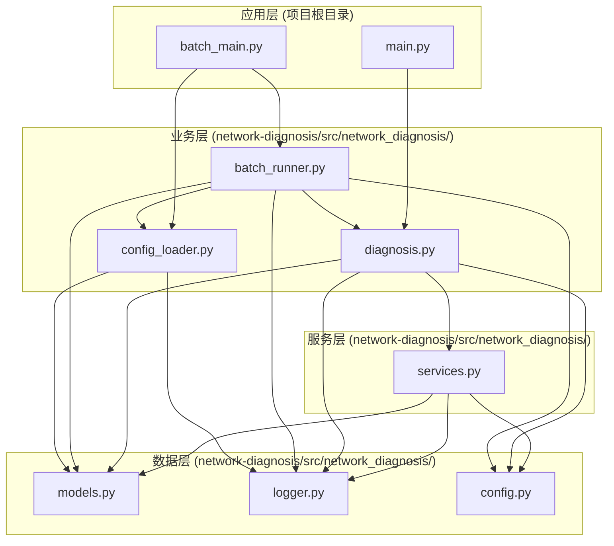

### 3.2 单目标诊断调用链

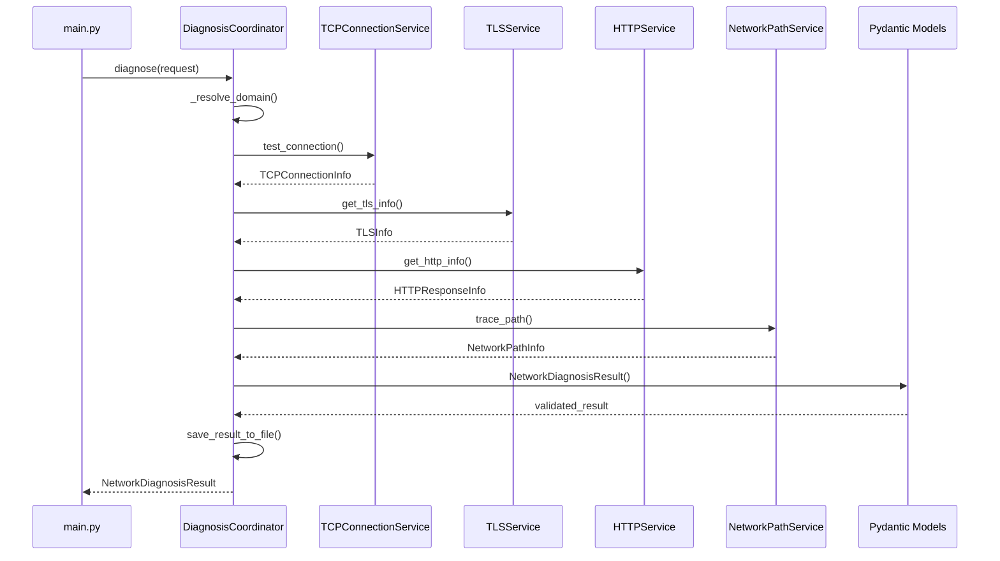

### 3.3 批量诊断调用链

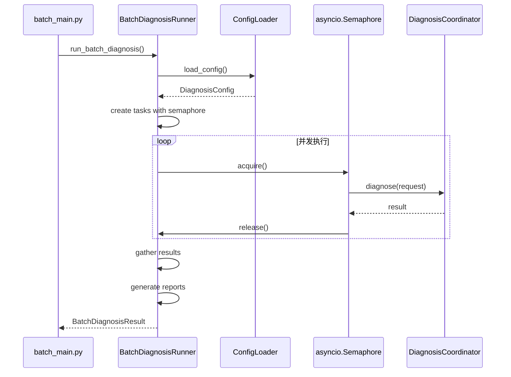

### 3.4 异步处理流程

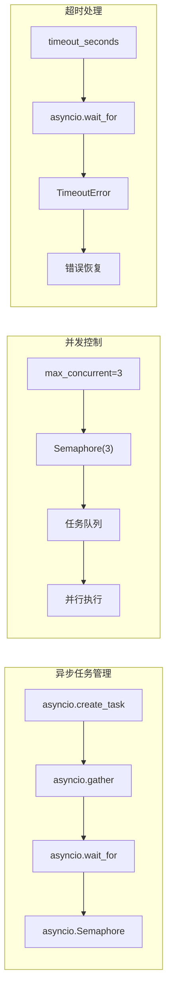

## 4. 配置管理架构

### 4.1 环境变量配置流程

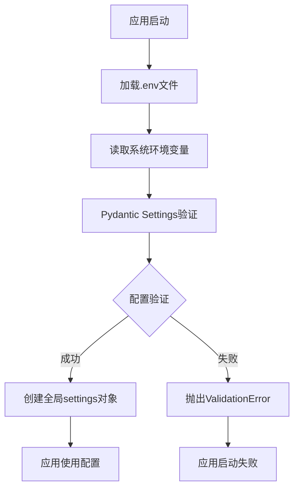

#### 配置类结构

```python
class AppSettings(BaseSettings):
    """应用配置类 - 位于 network-diagnosis/src/network_diagnosis/config.py"""

    # 配置来源优先级
    model_config = SettingsConfigDict(
        env_file='.env',           # 1. 项目根目录的.env文件
        env_file_encoding='utf-8',
        case_sensitive=True,
        extra='ignore'
    )

    # 配置项分类
    # 应用基础配置
    APP_NAME: str = "Network Diagnosis Tool"
    APP_VERSION: str = "1.0.0"
    DEBUG: bool = False

    # 网络诊断配置
    CONNECT_TIMEOUT: int = 10
    READ_TIMEOUT: int = 30
    MAX_REDIRECTS: int = 5

    # 系统配置
    SUDO_PASSWORD: Optional[str] = None
    OUTPUT_DIR: str = "./network-diagnosis/output"  # 动态计算路径

    # 日志配置
    LOG_LEVEL: str = "INFO"
    LOG_FORMAT: str = "%(asctime)s - %(name)s - %(levelname)s - %(message)s"

    def __init__(self, **kwargs):
        super().__init__(**kwargs)
        # 动态计算输出目录路径
        self.OUTPUT_DIR = str(Path(__file__).parent.parent.parent / "output")
```

### 4.2 YAML配置文件处理机制

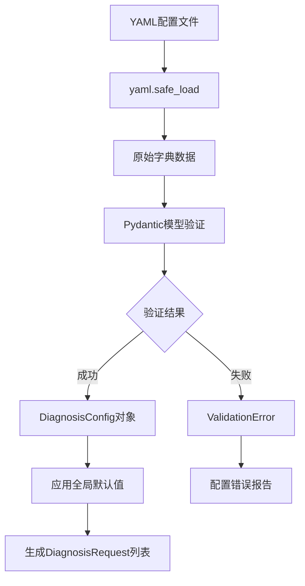

#### 配置模型层次结构
```python
# 配置模型层次
DiagnosisConfig
├── targets: List[TargetConfig]
│   ├── domain: str
│   ├── port: int
│   ├── include_trace: bool
│   ├── include_http: bool
│   └── description: Optional[str]
└── global_settings: GlobalSettings
    ├── default_port: int
    ├── max_concurrent: int
    ├── timeout_seconds: int
    ├── save_individual_files: bool
    └── save_summary_report: bool
```

### 4.3 配置验证和加载过程

```python
class ConfigLoader:
    """配置文件加载器"""

    def load_config(self) -> DiagnosisConfig:
        """配置加载流程"""
        # 1. 文件存在性检查
        if not self.config_file.exists():
            raise FileNotFoundError(f"Configuration file not found: {self.config_file}")

        # 2. YAML解析
        with open(self.config_file, 'r', encoding='utf-8') as f:
            raw_config = yaml.safe_load(f)

        # 3. Pydantic验证
        self.config = DiagnosisConfig(**raw_config)

        # 4. 应用全局默认值
        self._apply_global_defaults()

        return self.config

    def validate_config_file(self, config_file: str) -> bool:
        """配置文件验证"""
        try:
            temp_loader = ConfigLoader(config_file)
            temp_loader.load_config()
            return True
        except Exception as e:
            logger.error(f"Configuration validation failed: {str(e)}")
            return False
```

## 5. 数据模型架构

### 5.1 Pydantic模型结构

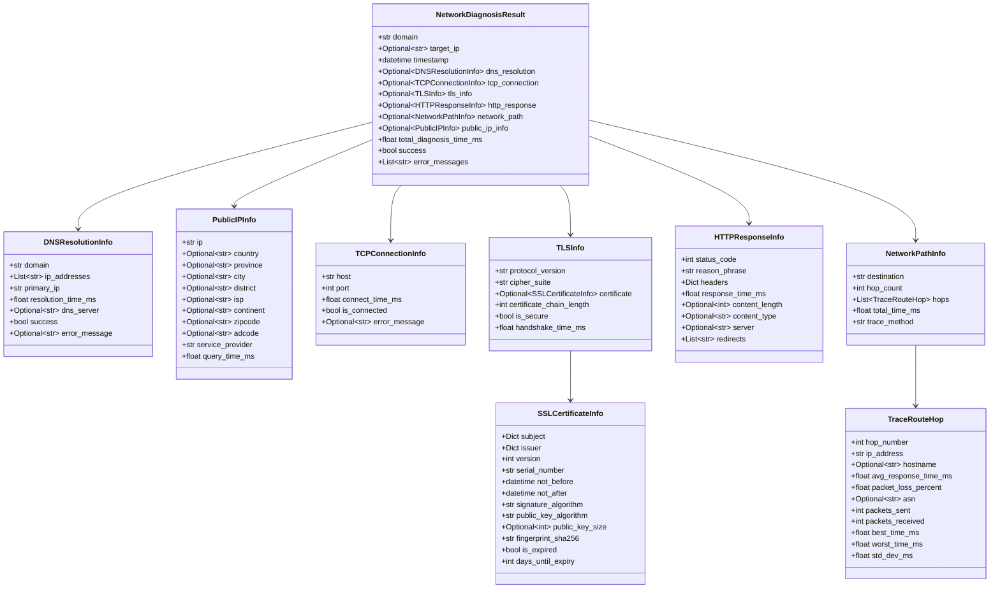

### 5.2 JSON输出格式规范

#### 单个诊断结果格式

```json
{
  "domain": "example.com",
  "target_ip": "93.184.216.34",
  "timestamp": "2025-09-10T12:00:00.000000",
  "dns_resolution": {
    "domain": "example.com",
    "ip_addresses": ["93.184.216.34", "2606:2800:220:1:248:1893:25c8:1946"],
    "primary_ip": "93.184.216.34",
    "resolution_time_ms": 45.23,
    "dns_server": "8.8.8.8",
    "success": true,
    "error_message": null
  },
  "tcp_connection": {
    "host": "example.com",
    "port": 443,
    "local_address": "192.168.1.100",
    "local_port": 54321,
    "remote_address": "93.184.216.34",
    "remote_port": 443,
    "connect_time_ms": 45.23,
    "is_connected": true,
    "socket_family": "AF_INET",
    "socket_type": "SOCK_STREAM",
    "error_message": null
  },
  "tls_info": {
    "protocol_version": "TLSv1.3",
    "cipher_suite": "TLS_AES_256_GCM_SHA384",
    "certificate": {
      "subject": {"CN": "example.com"},
      "issuer": {"CN": "DigiCert TLS RSA SHA256 2020 CA1"},
      "version": 3,
      "serial_number": "12345678901234567890",
      "not_before": "2024-01-01T00:00:00",
      "not_after": "2025-01-01T00:00:00",
      "signature_algorithm": "sha256WithRSAEncryption",
      "public_key_algorithm": "RSA",
      "public_key_size": 2048,
      "fingerprint_sha256": "abc123...",
      "is_expired": false,
      "days_until_expiry": 120
    },
    "certificate_chain_length": 3,
    "is_secure": true,
    "handshake_time_ms": 156.78
  },
  "http_response": {
    "status_code": 200,
    "reason_phrase": "OK",
    "headers": {
      "content-type": "text/html; charset=UTF-8",
      "server": "nginx/1.18.0"
    },
    "response_time_ms": 234.56,
    "content_length": 1024,
    "content_type": "text/html",
    "server": "nginx/1.18.0",
    "redirect_count": 0,
    "final_url": "https://example.com/"
  },
  "network_path": {
    "target_host": "example.com",
    "target_ip": "93.184.216.34",
    "trace_method": "mtr",
    "hops": [
      {
        "hop_number": 1,
        "ip_address": "192.168.1.1",
        "hostname": "gateway.local",
        "avg_response_time_ms": 1.23,
        "packet_loss_percent": 0.0,
        "asn": "AS12345",
        "packets_sent": 5,
        "packets_received": 5,
        "best_time_ms": 1.1,
        "worst_time_ms": 1.4,
        "std_dev_ms": 0.1
      }
    ],
    "total_hops": 8,
    "avg_latency_ms": 45.67,
    "packet_loss_percent": 0.0
  },
  "public_ip_info": {
    "ip": "203.0.113.1",
    "country": "中国",
    "province": "北京市",
    "city": "北京市",
    "district": "朝阳区",
    "isp": "中国电信",
    "continent": "亚洲",
    "zipcode": "100000",
    "adcode": "110105",
    "service_provider": "百度智能云",
    "query_time_ms": 123.45
  },
  "total_diagnosis_time_ms": 567.89,
  "success": true,
  "error_messages": []
}
```

#### 批量诊断报告格式
```json
{
  "summary": {
    "execution_summary": {
      "total_targets": 5,
      "successful": 4,
      "failed": 1,
      "success_rate": 80.0,
      "total_execution_time_ms": 2345.67,
      "start_time": "2025-09-10T12:00:00.000000",
      "end_time": "2025-09-10T12:00:02.345670",
      "config_file": "targets.yaml"
    },
    "performance_statistics": {
      "average_diagnosis_time_ms": 468.13,
      "average_tcp_connect_time_ms": 45.23,
      "fastest_diagnosis_ms": 234.56,
      "slowest_diagnosis_ms": 789.01
    },
    "security_statistics": {
      "tls_enabled_count": 3,
      "tls_protocols": {
        "TLSv1.3": 2,
        "TLSv1.2": 1
      },
      "secure_connections_rate": 75.0
    },
    "http_statistics": {
      "status_codes": {
        "200": 3,
        "403": 1
      },
      "http_enabled_count": 4
    }
  },
  "individual_results": [
    // 每个目标的完整诊断结果
  ]
}
```

### 5.3 数据转换和验证流程

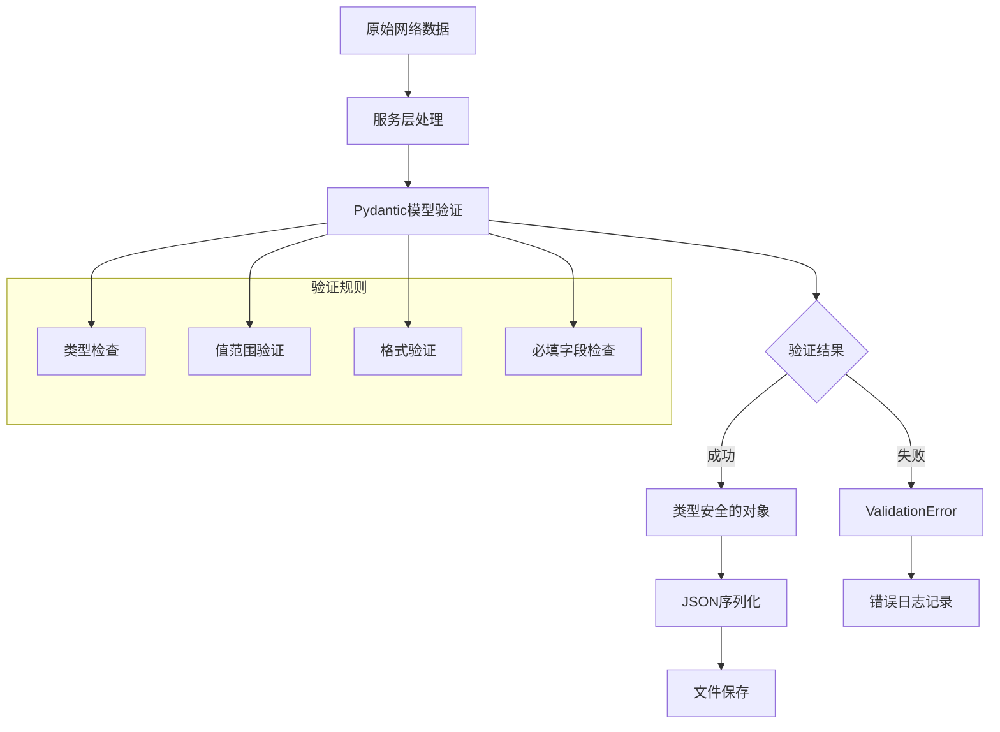

#### 数据验证示例
```python
class TCPConnectionInfo(BaseModel):
    """TCP连接信息验证"""
    host: str
    port: int = Field(..., ge=1, le=65535)  # 端口范围验证
    connect_time_ms: float = Field(..., ge=0)  # 时间非负验证
    is_connected: bool
    error_message: Optional[str] = None

    @validator('host')
    def validate_host(cls, v):
        """主机名验证"""
        if not v or len(v.strip()) == 0:
            raise ValueError('Host cannot be empty')
        return v.strip()

class SSLCertificateInfo(BaseModel):
    """SSL证书信息验证"""
    not_before: datetime
    not_after: datetime
    days_until_expiry: int

    @validator('days_until_expiry', pre=True, always=True)
    def calculate_days_until_expiry(cls, v, values):
        """自动计算证书到期天数"""
        if 'not_after' in values:
            delta = values['not_after'] - datetime.now(timezone.utc)
            return delta.days
        return v
```

## 6. 批量处理架构

### 6.1 并发执行机制

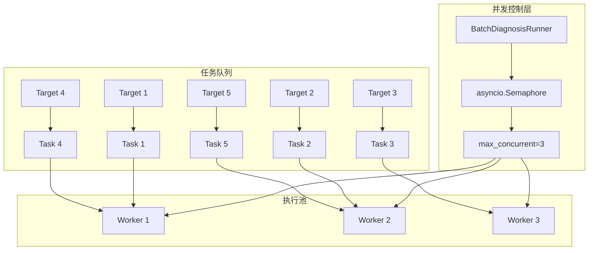

#### 并发控制实现
```python
class BatchDiagnosisRunner:
    """批量诊断运行器"""

    def __init__(self, config_file: str):
        self.config_loader = ConfigLoader(config_file)
        self.coordinator = DiagnosisCoordinator()

    async def run_batch_diagnosis(self) -> BatchDiagnosisResult:
        """执行批量诊断"""
        # 1. 加载配置
        config = self.config_loader.load_config()

        # 2. 创建信号量控制并发
        semaphore = asyncio.Semaphore(config.global_settings.max_concurrent)

        # 3. 创建诊断任务
        tasks = []
        for i, request in enumerate(self.diagnosis_requests):
            task = asyncio.create_task(
                self._diagnose_with_semaphore(semaphore, request, i + 1)
            )
            tasks.append(task)

        # 4. 并发执行所有任务
        results = await asyncio.gather(*tasks, return_exceptions=True)

        # 5. 处理结果和异常
        return self._process_batch_results(results)

    async def _diagnose_with_semaphore(
        self,
        semaphore: asyncio.Semaphore,
        request: DiagnosisRequest,
        index: int
    ) -> NetworkDiagnosisResult:
        """带信号量控制的诊断执行"""
        async with semaphore:  # 获取信号量
            try:
                logger.info(f"[{index}/{len(self.diagnosis_requests)}] Starting diagnosis for {request.domain}:{request.port}")

                # 执行诊断（带超时控制）
                result = await asyncio.wait_for(
                    self.coordinator.diagnose(request),
                    timeout=self.global_settings.timeout_seconds
                )

                logger.info(f"[{index}/{len(self.diagnosis_requests)}] {request.domain}:{request.port} - SUCCESS ({result.total_time_ms:.2f}ms)")
                return result

            except asyncio.TimeoutError:
                logger.error(f"[{index}/{len(self.diagnosis_requests)}] {request.domain}:{request.port} - TIMEOUT")
                return self._create_timeout_result(request)
            except Exception as e:
                logger.error(f"[{index}/{len(self.diagnosis_requests)}] {request.domain}:{request.port} - ERROR: {str(e)}")
                return self._create_error_result(request, str(e))
```

### 6.2 任务调度和管理

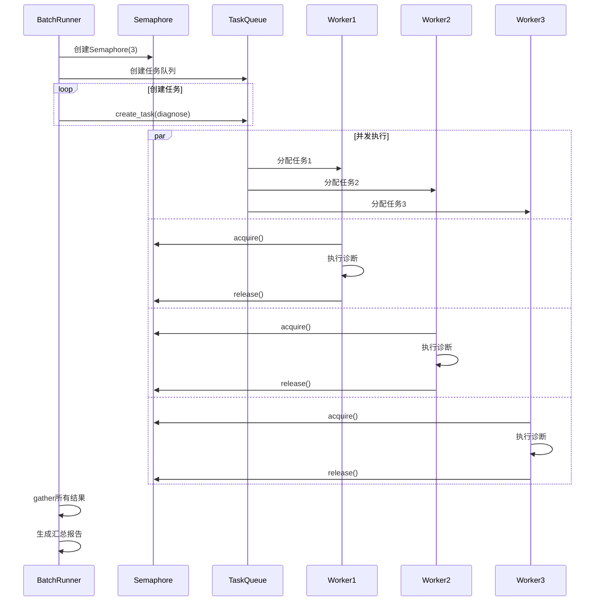

### 6.3 错误处理和恢复策略

#### 错误分类和处理
```python
class BatchDiagnosisRunner:
    """错误处理策略"""

    def _process_batch_results(self, results: List) -> BatchDiagnosisResult:
        """处理批量结果，包含错误恢复"""
        successful_results = []
        failed_results = []

        for i, result in enumerate(results):
            if isinstance(result, Exception):
                # 异常结果处理
                failed_result = self._handle_exception(result, i)
                failed_results.append(failed_result)
            elif isinstance(result, NetworkDiagnosisResult):
                if result.success:
                    successful_results.append(result)
                else:
                    failed_results.append(result)
            else:
                # 未知结果类型
                logger.error(f"Unknown result type: {type(result)}")
                failed_results.append(self._create_unknown_error_result(i))

        return self._create_batch_result(successful_results, failed_results)

    def _handle_exception(self, exception: Exception, index: int) -> NetworkDiagnosisResult:
        """异常处理策略"""
        if isinstance(exception, asyncio.TimeoutError):
            return self._create_timeout_result(self.diagnosis_requests[index])
        elif isinstance(exception, ConnectionError):
            return self._create_connection_error_result(self.diagnosis_requests[index], str(exception))
        elif isinstance(exception, ValidationError):
            return self._create_validation_error_result(self.diagnosis_requests[index], str(exception))
        else:
            return self._create_generic_error_result(self.diagnosis_requests[index], str(exception))
```

#### 错误恢复机制
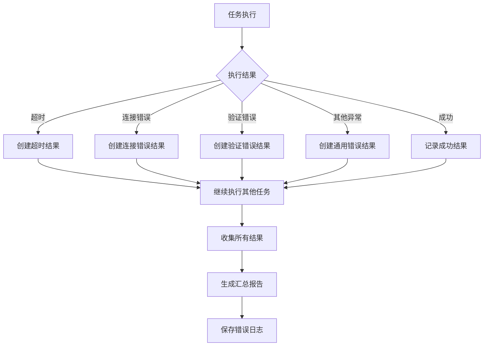

### 6.4 并发性能分析

#### 支持的并发数量
```python
# 配置参数
class GlobalSettings(BaseModel):
    max_concurrent: int = Field(default=3, ge=1, le=10)  # 最大并发数：1-10
    timeout_seconds: int = Field(default=60, ge=10, le=300)  # 超时时间：10-300秒
```

#### 并发性能特征
| 并发数 | 适用场景 | 性能特点 | 资源消耗 |
|--------|----------|----------|----------|
| 1 | 调试、慢速网络 | 串行执行，最稳定 | 最低 |
| 2-3 | 一般网络诊断 | 平衡性能和稳定性 | 中等 |
| 4-6 | 快速批量诊断 | 高性能，适合稳定网络 | 较高 |
| 7-10 | 大规模监控 | 最高性能，需要优质网络 | 最高 |

#### 并发限制因素
```python
# 系统资源限制
- 网络带宽：每个连接消耗一定带宽
- 文件描述符：每个socket连接占用一个fd
- 内存使用：每个异步任务占用内存
- CPU使用：TLS握手和证书解析消耗CPU

# 目标服务器限制
- 连接数限制：目标服务器可能限制并发连接
- 速率限制：防止被识别为攻击行为
- 防火墙规则：可能触发DDoS保护机制

# 推荐配置
max_concurrent = min(
    10,  # 系统最大支持
    target_count // 2,  # 目标数量的一半
    available_bandwidth // estimated_per_connection_bandwidth
)
```

#### 性能优化建议
```python
# 1. 动态调整并发数
def calculate_optimal_concurrency(target_count: int, network_quality: str) -> int:
    base_concurrent = {
        'poor': 1,
        'fair': 2,
        'good': 3,
        'excellent': 5
    }.get(network_quality, 3)

    return min(base_concurrent, max(1, target_count // 3))

# 2. 分批处理大量目标
async def process_large_batch(targets: List[str], batch_size: int = 50):
    for i in range(0, len(targets), batch_size):
        batch = targets[i:i + batch_size]
        await process_batch(batch)
        await asyncio.sleep(1)  # 批次间休息

# 3. 智能超时设置
def calculate_timeout(target_type: str) -> int:
    timeouts = {
        'web_server': 30,
        'api_endpoint': 45,
        'dns_server': 60,
        'internal_service': 20
    }
    return timeouts.get(target_type, 60)
```

## 7. 总结

### 7.1 架构优势

1. **模块化设计**：清晰的分层架构，职责分离
2. **类型安全**：Pydantic模型提供运行时类型验证
3. **异步高性能**：基于asyncio的并发处理
4. **配置外部化**：遵循十二要素应用原则
5. **错误恢复**：完善的异常处理和错误恢复机制
6. **可扩展性**：易于添加新的诊断功能和输出格式
7. **安全性**：sudoers配置避免密码硬编码
8. **多服务容错**：公网IP信息收集支持多服务商容错
9. **灵活配置**：支持URL和域名+端口两种配置方式
10. **增强追踪**：mtr提供ASN信息和详细网络统计

### 7.2 技术栈总结

| 层次 | 技术栈 | 作用 |
|------|--------|------|
| 应用层 | argparse, asyncio | 命令行解析、异步执行 |
| 业务层 | Pydantic v2, PyYAML | 数据验证、配置管理 |
| 服务层 | socket, ssl, httpx, subprocess | 网络诊断实现 |
| 数据层 | JSON, cryptography | 数据序列化、证书解析 |
| 基础设施 | logging, pathlib | 日志记录、文件操作 |
| 网络工具 | mtr, traceroute | 网络路径追踪 |
| 包管理 | uv | 现代Python包管理器 |

### 7.3 当前实现特性

#### 核心功能特性
- **DNS解析分析**：详细的域名解析信息和性能统计
- **TCP连接测试**：包含本地/远程地址、Socket类型等详细信息
- **TLS/SSL分析**：完整的证书链分析和安全评估
- **HTTP响应检查**：支持重定向跟踪和详细响应分析
- **网络路径追踪**：mtr优先，包含ASN信息和丢包统计
- **公网IP信息**：多服务商容错的地理位置信息收集

#### 配置和控制特性
- **TLS开关控制**：可配置是否进行TLS检测
- **URL检测支持**：直接使用URL进行诊断
- **智能路径解析**：配置文件路径自动解析
- **动态输出目录**：基于配置文件名创建子目录
- **统一日志系统**：双输出（控制台+文件）

#### 运维和部署特性
- **sudoers集成**：无密码执行mtr命令
- **容器化支持**：Docker和Kubernetes部署
- **环境变量配置**：完整的十二要素应用支持
- **并发控制**：可配置的并发数和超时控制
- **错误恢复**：完善的异常处理和重试机制

### 7.4 扩展方向

1. **Web界面**：基于FastAPI的REST API和Web UI
2. **数据库存储**：历史数据存储和趋势分析
3. **监控告警**：阈值监控和实时告警
4. **分布式执行**：多节点分布式诊断
5. **插件系统**：可插拔的诊断模块
6. **机器学习**：网络性能预测和异常检测
7. **多协议支持**：UDP、ICMP等协议诊断
8. **云原生集成**：Prometheus指标、Grafana仪表板
