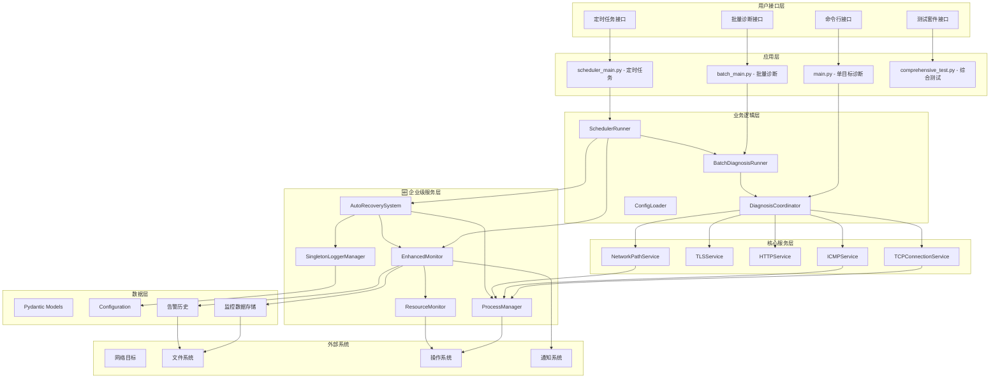
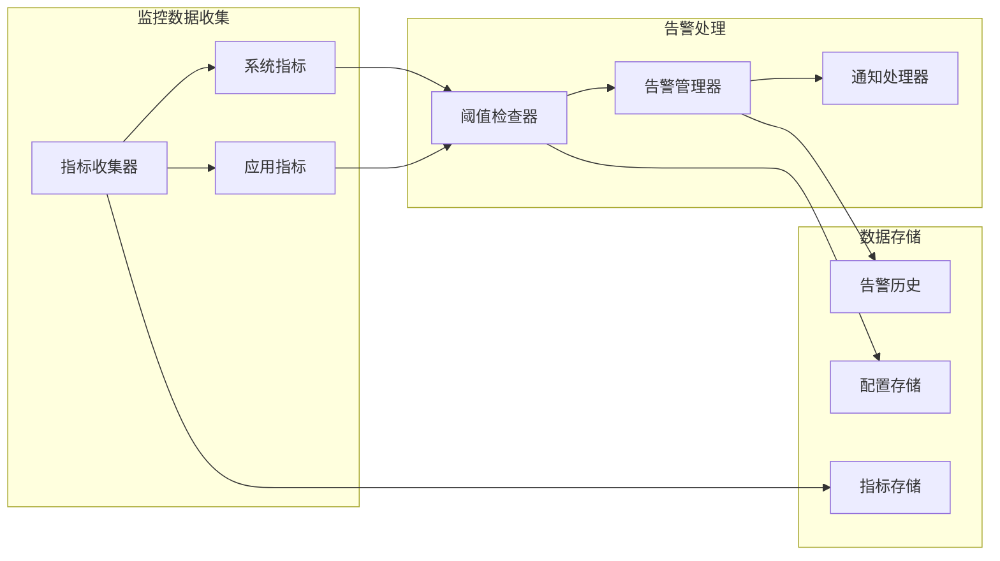
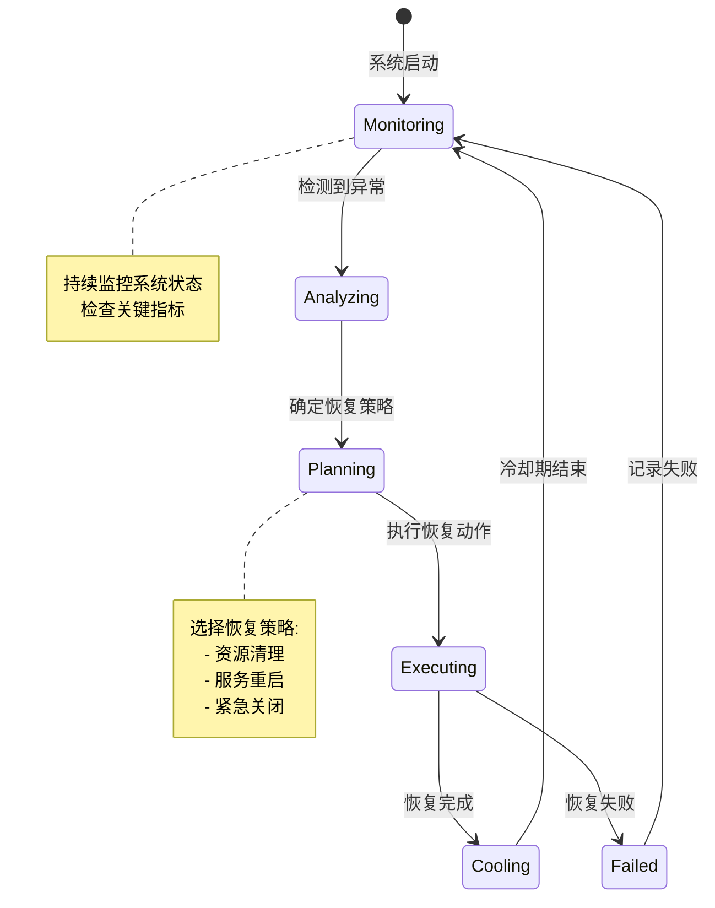
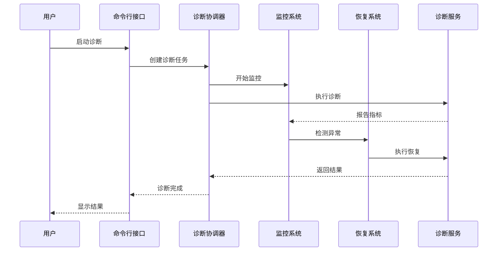
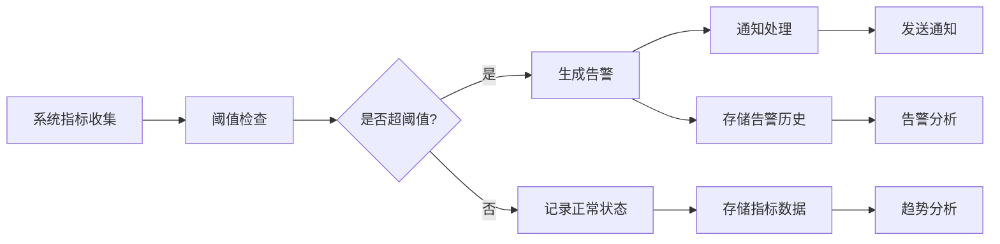
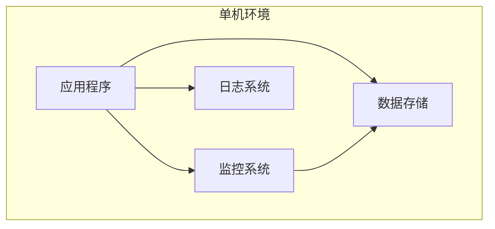
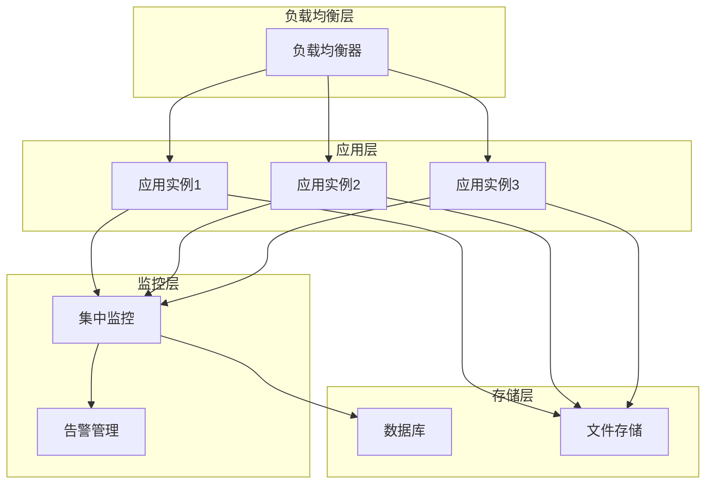

# 网络诊断工具系统架构文档

> 🏗️ **企业级网络诊断和监控平台** - 技术架构和设计原理

## 📖 目录

1. [系统架构概览](#系统架构概览)
2. [企业级架构特性](#企业级架构特性)
3. [核心组件设计](#核心组件设计)
4. [监控和恢复架构](#监控和恢复架构)
5. [数据流和处理](#数据流和处理)
6. [安全和可靠性](#安全和可靠性)
7. [性能和扩展性](#性能和扩展性)
8. [部署架构](#部署架构)

## 1. 系统架构概览

### 1.1 整体架构图



### 1.2 架构层次说明

#### 🎯 **用户接口层**
- **CLI**: 命令行接口，支持单目标和批量诊断
- **SchedulerCLI**: 定时任务管理接口
- **TestSuite**: 综合测试和验证接口

#### 🚀 **应用层**
- **Main**: 单目标诊断应用入口
- **BatchMain**: 批量诊断应用入口
- **SchedulerMain**: 定时任务调度器
- **ComprehensiveTest**: 综合测试套件

#### 🧠 **业务逻辑层**
- **DiagnosisCoordinator**: 诊断流程协调器
- **BatchDiagnosisRunner**: 批量诊断执行器
- **SchedulerRunner**: 定时任务运行器
- **ConfigLoader**: 配置加载和管理

#### 🔧 **核心服务层**
- **TCPConnectionService**: TCP连接测试服务
- **TLSService**: TLS/SSL分析服务
- **HTTPService**: HTTP响应检查服务
- **ICMPService**: ICMP探测服务
- **NetworkPathService**: 网络路径追踪服务

#### 🛡️ **企业级服务层**
- **SingletonLoggerManager**: 单例日志管理器
- **EnhancedMonitor**: 增强监控系统
- **AutoRecoverySystem**: 自动恢复机制
- **ProcessManager**: 统一进程管理器
- **ResourceMonitor**: 系统资源监控器

### 1.3 核心组件对比

| 组件类型 | 传统架构 | 企业级架构 | 改进效果 |
|----------|----------|------------|----------|
| **日志管理** | 每次创建新处理器 | 单例模式管理 | 零资源泄漏 |
| **进程管理** | 分散式管理 | 统一进程管理器 | 避免僵尸进程 |
| **监控能力** | 基础资源监控 | 智能监控+告警 | 实时健康监控 |
| **故障处理** | 手动干预 | 自动恢复机制 | 自动故障恢复 |
| **测试覆盖** | 基础功能测试 | 30+综合测试 | 全面质量保证 |

## 2. 企业级架构特性

### 2.1 零资源泄漏架构

#### 🔧 **单例日志管理器**

```python
class SingletonLoggerManager:
    _instance: Optional['SingletonLoggerManager'] = None
    _lock = threading.Lock()
    
    def __new__(cls) -> 'SingletonLoggerManager':
        if cls._instance is None:
            with cls._lock:
                if cls._instance is None:
                    cls._instance = super().__new__(cls)
        return cls._instance
```

**核心特性**:

- **线程安全**: 使用双重检查锁定模式
- **资源复用**: 避免重复创建日志处理器
- **自动清理**: 智能资源管理和释放
- **配置缓存**: 复用日志配置，提高性能

#### 🔄 **统一进程管理器**

```python
@asynccontextmanager
async def managed_subprocess(*args, timeout=None, description="", **kwargs):
    async with process_manager.create_subprocess(*args, timeout=timeout, description=description, **kwargs) as process:
        yield process
```

**核心特性**:

- **上下文管理**: 自动资源清理
- **超时控制**: 防止进程挂起
- **状态跟踪**: 完整的进程生命周期管理
- **异常处理**: 优雅的错误处理和恢复

### 2.2 智能监控架构

#### 📊 **增强监控系统**



**核心特性**:

- **实时监控**: 系统资源和应用指标
- **智能告警**: 可配置阈值和多级告警
- **数据持久化**: JSON Lines格式存储
- **多种通知**: 日志、文件、邮件等方式

### 2.3 自动恢复架构

#### 🛡️ **自动恢复系统**



**核心特性**:

- **故障检测**: 自动识别系统异常
- **智能恢复**: 多种恢复策略选择
- **冷却机制**: 防止频繁恢复操作
- **状态跟踪**: 完整的恢复历史记录

## 3. 核心组件设计

### 3.1 诊断协调器

```python
class DiagnosisCoordinator:
    """统一管理所有诊断功能的协调器"""
    
    def __init__(self):
        self.tcp_service = TCPConnectionService()
        self.tls_service = TLSService()
        self.http_service = HTTPService()
        self.icmp_service = ICMPService()
        self.path_service = NetworkPathService()
        self.resource_monitor = ResourceMonitor()
    
    async def diagnose(self, target: str, port: int) -> DiagnosisResult:
        """执行完整的网络诊断流程"""
        # 实现诊断逻辑
        pass
```

### 3.2 批量诊断运行器

```python
class BatchDiagnosisRunner:
    """批量诊断执行器，支持并发和监控"""
    
    def __init__(self, config: BatchConfig):
        self.config = config
        self.coordinator = DiagnosisCoordinator()
        self.monitor = get_enhanced_monitor()
        self.recovery = get_auto_recovery_system()
    
    async def run_batch_diagnosis(self, targets: List[Target]) -> BatchResult:
        """执行批量诊断，包含监控和恢复"""
        # 实现批量诊断逻辑
        pass
```

## 4. 监控和恢复架构

### 4.1 监控数据模型

```python
@dataclass
class AlertThreshold:
    metric_name: str
    warning_threshold: float
    critical_threshold: float
    comparison: str = "greater"
    enabled: bool = True

@dataclass
class AlertEvent:
    timestamp: datetime
    level: str
    metric_name: str
    current_value: float
    threshold_value: float
    message: str
    resolved: bool = False
```

### 4.2 恢复策略配置

```python
class RecoveryAction(Enum):
    CLEANUP_RESOURCES = "cleanup_resources"
    RESTART_LOGGING = "restart_logging"
    KILL_PROCESSES = "kill_processes"
    EMERGENCY_SHUTDOWN = "emergency_shutdown"

@dataclass
class RecoveryRule:
    name: str
    trigger_condition: str
    action: RecoveryAction
    max_attempts: int = 3
    cooldown_seconds: int = 300
    enabled: bool = True
```

## 5. 数据流和处理

### 5.1 诊断数据流



### 5.2 监控数据流



## 6. 安全和可靠性

### 6.1 安全特性

- **资源隔离**: 进程间资源隔离
- **权限控制**: 最小权限原则
- **数据保护**: 敏感数据加密存储
- **审计日志**: 完整的操作审计

### 6.2 可靠性保证

- **故障隔离**: 组件间故障隔离
- **优雅降级**: 部分功能失效时的降级策略
- **数据一致性**: 确保数据完整性
- **恢复机制**: 多层次的恢复策略

## 7. 性能和扩展性

### 7.1 性能优化

- **并发处理**: 异步IO和并发执行
- **资源复用**: 连接池和对象池
- **缓存策略**: 智能缓存机制
- **内存管理**: 优化内存使用

### 7.2 扩展性设计

- **模块化**: 松耦合的模块设计
- **插件架构**: 支持功能扩展
- **配置驱动**: 灵活的配置管理
- **API接口**: 标准化的接口设计

## 8. 部署架构

### 8.1 单机部署



### 8.2 分布式部署



---

**🎉 本架构文档描述了网络诊断工具的完整企业级架构，包括智能监控、自动恢复和高可用特性，为长期稳定运行提供了坚实的技术基础。**
